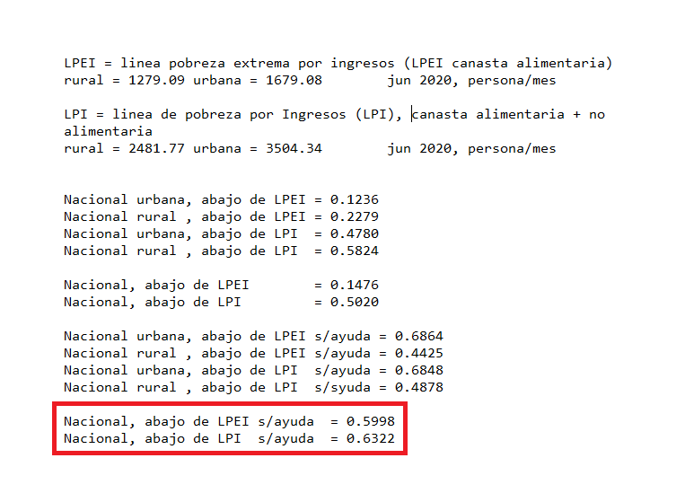
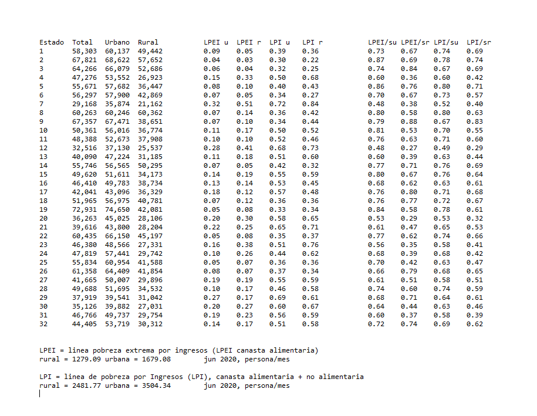

## Povery lines and "ayudas" in ENIGH 2020

This computation tries to reproduce Máximo Ernesto Jaramillo-Molina's (@rojo_neon on TW)
claim re. % of people under the poverty lines that do not receive governmental
monetary support, a.k.a "ayudas".

The source was INEGI's latest ENIGH survey of 2020 and the poverty line estimates of CONEVAL. 

I count only total current income ("ingreso corriente total"), without including extra
income for financial and capital transactions ("percepciones financieras y de
capital"), which are irregular in nature and include items such as borrowed money.

## Results

Emplying two standard measures of poverty (CONEVAL's LPEI and LPI), I calculated that
14.76% of the national population were below the exteme poverty line (LPEI) and 50% below 
the line of poverty with respect to food (LPI). I also obtained practically the same results 
as Jaramillo-Molina: approximately 60% of the population below the LPEI poverty 
line do not receive any direct help from the federal government and 63% below the LPI line.

Other values of use were calculated: the average quarterly income by state (total, urban, rural), as well
as percentages of the population below the poverty lines by state, urban and rural 
("LPEI u", "LPEI r", "LPI u", "LPI r") and of the population below the poverty lines
that do not receive help by state, urban and rural ("LPEI/su", "LPEI/sr", "LPI/su", "LPI/sr").

# Code

The main results come from `ENIGH2020_2.java` and use INEGI's `concentradohogar.csv` file. This code
can be used as a model to run other calculations from ENIGH. `ENIGH2020.java` is based on INEGI's old DB scheme
(2016 and earlier?). 

`ENIGH2020_3.java` was used to estimate percentages earning around a minimum salary. I didn't take
that any further but the results are very different from INEGI's data based on ENOE surveys. I do not
know why.

All code runs directly after compiling in the same directory. Output is to the shell. The only detail is
to fix the path where the code expects the csv file to be before compiling. 

# Data

[concentradohogar.csv](https://www.inegi.org.mx/programas/enigh/nc/2020/#Microdatos)

## Status

Finished 

* Stand-alone Java
